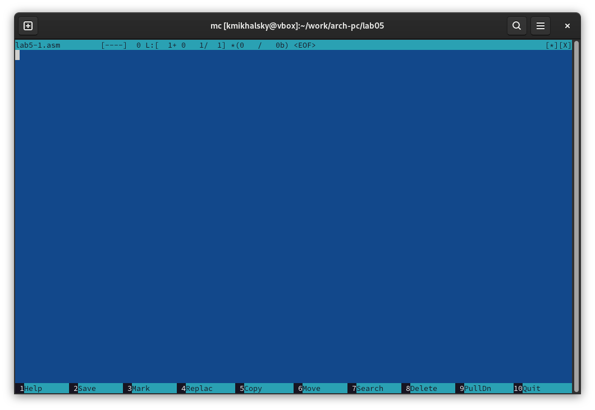

---
## Front matter
title: "Отчёт по лабораторной работе №5"
subtitle: "Простейший вариант"
author: "Михальский Кирилл Алексеевич"

## Generic otions
lang: ru-RU
toc-title: "Содержание"

## Bibliography
bibliography: bib/cite.bib
csl: pandoc/csl/gost-r-7-0-5-2008-numeric.csl

## Pdf output format
toc: true # Table of contents
toc-depth: 2
lof: true # List of figures
lot: true # List of tables
fontsize: 12pt
linestretch: 1.5
papersize: a4
documentclass: scrreprt
## I18n polyglossia
polyglossia-lang:
  name: russian
  options:
	- spelling=modern
	- babelshorthands=true
polyglossia-otherlangs:
  name: english
## I18n babel
babel-lang: russian
babel-otherlangs: english
## Fonts
mainfont: IBM Plex Serif
romanfont: IBM Plex Serif
sansfont: IBM Plex Sans
monofont: IBM Plex Mono
mathfont: STIX Two Math
mainfontoptions: Ligatures=Common,Ligatures=TeX,Scale=0.94
romanfontoptions: Ligatures=Common,Ligatures=TeX,Scale=0.94
sansfontoptions: Ligatures=Common,Ligatures=TeX,Scale=MatchLowercase,Scale=0.94
monofontoptions: Scale=MatchLowercase,Scale=0.94,FakeStretch=0.9
mathfontoptions:
## Biblatex
biblatex: true
biblio-style: "gost-numeric"
biblatexoptions:
  - parentracker=true
  - backend=biber
  - hyperref=auto
  - language=auto
  - autolang=other*
  - citestyle=gost-numeric
## Pandoc-crossref LaTeX customization
figureTitle: "Рис."
tableTitle: "Таблица"
listingTitle: "Листинг"
lofTitle: "Список иллюстраций"
lotTitle: "Список таблиц"
lolTitle: "Листинги"
## Misc options
indent: true
header-includes:
  - \usepackage{indentfirst}
  - \usepackage{float} # keep figures where there are in the text
  - \floatplacement{figure}{H} # keep figures where there are in the text
---

# Цель работы

Приобретение практических навыков работы в Midnight Commander. Освоение инструкций языка ассемблера mov, int.

# Задание

1. Основы работы с mc
2. Структура программы на языке ассемблера NASM
3. Подключение внешнего файла
4. Выполнение заданий для самостоятельной работы

# Теоретическое введение

Midnight Commander (или просто mc) — это программа, которая позволяет просматривать структуру каталогов и выполнять основные операции по управлению файловой системой, т.е. mc является файловым менеджером. Midnight Commander позволяет сделать работу с файлами более удобной и наглядной. Программа на языке ассемблера NASM, как правило, состоит из трёх секций: секция кода программы (SECTION .text), секция инициированных (известных во время компиляции) данных (SECTION .data) и секция неинициализированных данных (тех, под которые во время компиляции только отводится память, а значение присваивается в ходе выполнения программы) (SECTION .bss). Для объявления инициированных данных в секции .data используются директивы DB, DW, DD, DQ и DT, которые резервируют память и указывают, какие значения должны храниться в этой памяти.

# Выполнение лабораторной работы

1. Открыл Midnight Commander командой mc (рис. [-@fig:001]).
{#fig:001 width=70%}

2. Перешел в нужный каталог (рис. [-@fig:002]).
{#fig:002 width=70%}

3. Создал папку и перешел в нее (рис. [-@fig:003]).
{#fig:003 width=70%}

4. Создал файл la5-1.asm (рис. [-@fig:004]).
{#fig:004 width=70%}

5. Открыл нужный файл для редактировния (рис. [-@fig:005]).
{#fig:005 width=70%}

6. Ввел текст программы (рис. [-@fig:006]).
{#fig:006 width=70%}

7. Убедился в правильности введенног текста (рис. [-@fig:007]).
{#fig:007 width=70%}

8. Скомпилировал файл и проверил правильность работы (рис. [-@fig:008]).
{#fig:008 width=70%}

9. Скачал файл со страницы в ТУИС.
10. Файл лежит в том же каталоге, в котором он используется (рис. [-@fig:010]).
{#fig:010 width=70%}

11. Создал копию файла с именем lab5-2.asm (рис. [-@fig:011]).
{#fig:011 width=70%}

12. Ввел новый текст программы (рис. [-@fig:012]).
{#fig:012 width=70%}

13. Проверил работу нового кода. Разница в формате вывода, в новом файле отсутствует переход на новую строку (рис. [-@fig:013]).
{#fig:013 width=70%}

# Выполнение заданий для самостоятельной работы

1. Создал копию файла и внес изменения в код программы (рис. [-@fig:018])(рис. [-@fig:019]).
{#fig:018 width=70%}
{#fig:019 width=70%}

2. Проверил работу исполняемого файла (рис. [-@fig:020]).
{#fig:020 width=70%}

3. Создал копию файла lab5-22.asm и исправил текст программы (рис. [-@fig:022]).
{#fig:022 width=70%}

4. Проверил работу исполняемого файла (рис. [-@fig:023]).
{#fig:023 width=70%}

# Выводы

При выполнении данной лабораторной работы я приобрел практические навыки работы в Midnight Commander, а также освоил инструкции языка ассемблера mov и int.

# Список литературы{.unnumbered}

::: {#refs}
::: esystem.rudn.ru
