---
## Front matter
title: "Отчет пол лабораторной работе №6"
subtitle: "Простейший вариант"
author: "Михальский Кирилл Алексеевич"

## Generic otions
lang: ru-RU
toc-title: "Содержание"

## Bibliography
bibliography: bib/cite.bib
csl: pandoc/csl/gost-r-7-0-5-2008-numeric.csl

## Pdf output format
toc: true # Table of contents
toc-depth: 2
lof: true # List of figures
lot: true # List of tables
fontsize: 12pt
linestretch: 1.5
papersize: a4
documentclass: scrreprt
## I18n polyglossia
polyglossia-lang:
  name: russian
  options:
	- spelling=modern
	- babelshorthands=true
polyglossia-otherlangs:
  name: english
## I18n babel
babel-lang: russian
babel-otherlangs: english
## Fonts
mainfont: IBM Plex Serif
romanfont: IBM Plex Serif
sansfont: IBM Plex Sans
monofont: IBM Plex Mono
mathfont: STIX Two Math
mainfontoptions: Ligatures=Common,Ligatures=TeX,Scale=0.94
romanfontoptions: Ligatures=Common,Ligatures=TeX,Scale=0.94
sansfontoptions: Ligatures=Common,Ligatures=TeX,Scale=MatchLowercase,Scale=0.94
monofontoptions: Scale=MatchLowercase,Scale=0.94,FakeStretch=0.9
mathfontoptions:
## Biblatex
biblatex: true
biblio-style: "gost-numeric"
biblatexoptions:
  - parentracker=true
  - backend=biber
  - hyperref=auto
  - language=auto
  - autolang=other*
  - citestyle=gost-numeric
## Pandoc-crossref LaTeX customization
figureTitle: "Рис."
tableTitle: "Таблица"
listingTitle: "Листинг"
lofTitle: "Список иллюстраций"
lotTitle: "Список таблиц"
lolTitle: "Листинги"
## Misc options
indent: true
header-includes:
  - \usepackage{indentfirst}
  - \usepackage{float} # keep figures where there are in the text
  - \floatplacement{figure}{H} # keep figures where there are in the text
---

# Цель работы

Освоение арифметических инструкций языка ассемблера NASM

# Задание

1. Символьные и численные данные в NASM
2. Выполнение арифметических операций в NASM

# Теоретическое введение

 Большинство инструкций на языке ассемблератребуютобработки операндов.Адрес опе
ранда предоставляетместо,где хранятся данные,подлежащие обработке.Это могутбыть
 данные хранящиеся в регистре или в ячейке памяти.Далее рассмотрены все существующие
 способы задания адреса хранения операндов–способы адресации.
 Существуеттри основных способа адресации:
 * Регистровая адресация–операндыхранятся врегистрах и в команде используются
 имена этих регистров,например: mov ax,bx.
 * Непосредственная адресация–значение операнда задается непосредственно в ко
манде,Например: mov ax,2.
 * Адресация памяти–операндзадаетадресвпамяти.Вкомандеуказывается символи
ческое обозначение ячейки памяти,над содержимым которойтребуется выполнить
 операцию.

# Выполнение лабораторной работы

1. Создал каталог и файл lab6-1.asm.

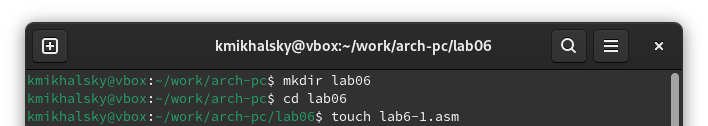{#fig:001 width=70%}

2. Вставил текст программы и запустил.

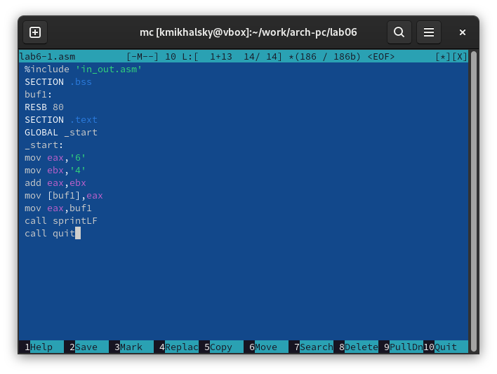{#fig:002 width=70%}

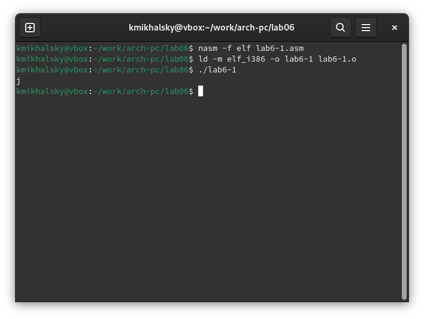{#fig:003 width=70%}

3. Внес необзодимые изменения и запустил. Код соответствует пустому символу перевода строки, который и отображался на экране.

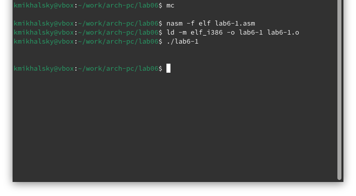{#fig:004 width=70%}

4. Создал файл lab6-2.asm, вставил текст программы и запустил исполняемый файл.

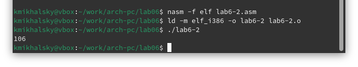{#fig:005 width=70%}

5. Внес изменения в файл lab6-2.asm. 6 + 4 = 10. Заменил функцию iprintLF на iprint и запустил исполняемый файл. Не отобразился перевод строки.

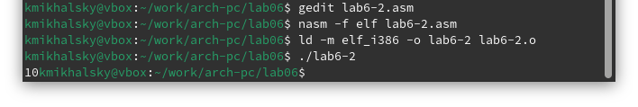{#fig:006 width=70%}

{#fig:007 width=70%}

6. Создал файл lab6-3.asm. Ввел текст программы. Исправил текст программы.

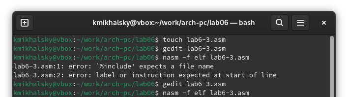{#fig:008 width=70%}

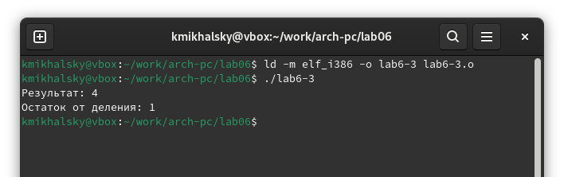{#fig:009 width=70%}

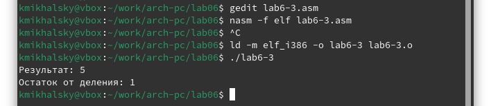{#fig:010 width=70%}

7. Создал файл variant.asm, ввел текст и запустил.

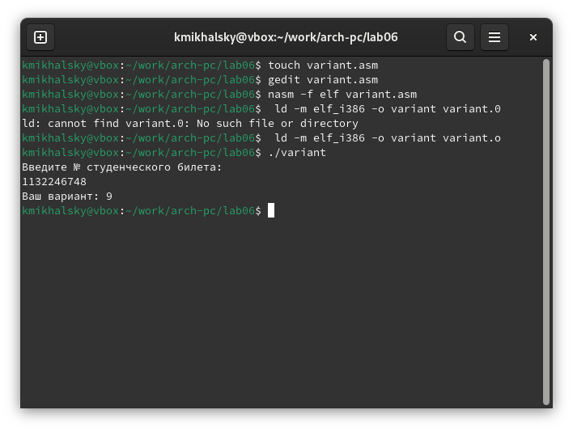{#fig:011 width=70%}

1. ```mov eax,rem
call sprint```

2. Инструкция mov ecx, x используется, чтобы положить адрес вводимой строки x в регистр ecx mov edx, 80 - запись в регистр edx длины вводимой строки call sread - вызов подпрограммы из внешнего файла, обеспечивающей ввод сообщения с клавиатуры

3. call atoi используется для вызова подпрограммы из внешнего файла, которая преобразует ascii-код символа в целое число и записывает результат в регистр eax

4. ```xor edx,edx ; обнуление edx для корректной работы div
mov ebx,20 ; ebx = 20
div ebx ; eax = eax/20, edx - остаток от деления
inc edx ; edx = edx + 1```

5. При выполнении инструкции div ebx остаток от деления записывается в регистр edx

6. Инструкция inc edx увеличивает значение регистра edx на 1

7. ```mov eax,edx
call iprintLF```

# Выполнение задания для самостоятельной работы.

1. Копировал файл lab6-4, исправил текст программы для работы по условию, проверил правильность используя переменные из задачи. Вариант 9

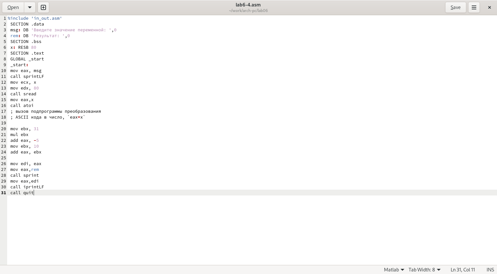{#fig:012 width=70%}

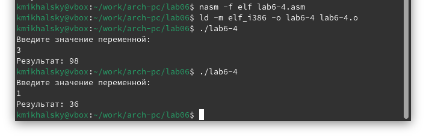{#fig:013 width=70%}

# Выводы

Я освоил арифметические конструкции языка ассемблера.

# Список литературы{.unnumbered}

::: {#refs}
:::
