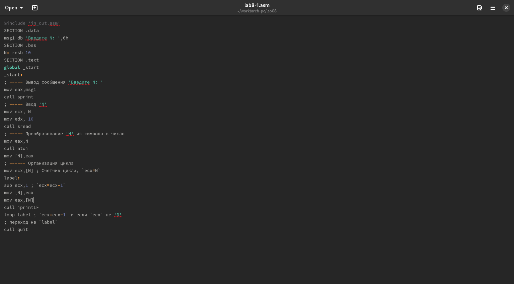

---
## Front matter
title: "Лабораторная работа №8"
subtitle: "Архитектура Компьютера"
author: "Михальский Кирилл Алексеевич"

## Generic otions
lang: ru-RU
toc-title: "Содержание"

## Bibliography
bibliography: bib/cite.bib
csl: pandoc/csl/gost-r-7-0-5-2008-numeric.csl

## Pdf output format
toc: true # Table of contents
toc-depth: 2
lof: true # List of figures
lot: true # List of tables
fontsize: 12pt
linestretch: 1.5
papersize: a4
documentclass: scrreprt
## I18n polyglossia
polyglossia-lang:
  name: russian
  options:
	- spelling=modern
	- babelshorthands=true
polyglossia-otherlangs:
  name: english
## I18n babel
babel-lang: russian
babel-otherlangs: english
## Fonts
mainfont: IBM Plex Serif
romanfont: IBM Plex Serif
sansfont: IBM Plex Sans
monofont: IBM Plex Mono
mathfont: STIX Two Math
mainfontoptions: Ligatures=Common,Ligatures=TeX,Scale=0.94
romanfontoptions: Ligatures=Common,Ligatures=TeX,Scale=0.94
sansfontoptions: Ligatures=Common,Ligatures=TeX,Scale=MatchLowercase,Scale=0.94
monofontoptions: Scale=MatchLowercase,Scale=0.94,FakeStretch=0.9
mathfontoptions:
## Biblatex
biblatex: true
biblio-style: "gost-numeric"
biblatexoptions:
  - parentracker=true
  - backend=biber
  - hyperref=auto
  - language=auto
  - autolang=other*
  - citestyle=gost-numeric
## Pandoc-crossref LaTeX customization
figureTitle: "Рис."
tableTitle: "Таблица"
listingTitle: "Листинг"
lofTitle: "Список иллюстраций"
lotTitle: "Список таблиц"
lolTitle: "Листинги"
## Misc options
indent: true
header-includes:
  - \usepackage{indentfirst}
  - \usepackage{float} # keep figures where there are in the text
  - \floatplacement{figure}{H} # keep figures where there are in the text
---

# Цель работы

Приобретение навыков написания программ с использованием циклов и обработкой аргументов командной строки.

# Задание

 1.   Реализация циклом в NASM
 2.   Обработка аргументов командной строки
 3.   Самостоятельное написание программы по материалам лабораторной работы

# Теоретическое введение

Стек — это структура данных, организованная по принципу LIFO («Last In — First Out» или «последним пришёл — первым ушёл»). Стек является частью архитектуры процессора и реализован на аппаратном уровне. Для работы со стеком в процессоре есть специальные регистры (ss, bp, sp) и команды. Основной функцией стека является функция сохранения адресов возврата и передачи аргументов при вызове процедур. Кроме того, в нём выделяется память для локальных переменных и могут временно храниться значения регистров.

# Выполнение лабораторной работы

1. Создал каталог и файл lab8-1. Ввел текст программы.

{#fig:002 width=70%}

Проверил работу программы.

{#fig:003 width=70%}

Ввел необзодимые изменения в работу программы.

{#fig:004 width=70%}

Проверил работу измененной программы.

{#fig:005 width=70%}

Ввел изменения в код программы.

{#fig:006 width=70%}

Проверил работу измененной программы.

{#fig:007 width=70%}

Создал файл lab8-2 и ввел текст программы.

{#fig:008 width=70%}

Запустил с необзодимыми аргументами. Программа обрабатывает все введенные аргументы.

{#fig:009 width=70%}

ВВе текст программы lab8-3.

{#fig:010 width=70%}

Проверил работу программы.

{#fig:011 width=70%}

Внес необзодимые изменения и проверил правильность работы программы:

{#fig:012 width=70%}

# Задания для самостоятельной работы

1. Написал программу по условию.
Проверил правильность работы программы.

{#fig:001 width=70%}

# Выводы

В результате выполнения данной лабораторной работы я приобрел навыки написания программ с использованием циклов а также научился обрабатывать аргументы командной строки.

# Список литературы{.unnumbered}

::: {#refs}
:::
