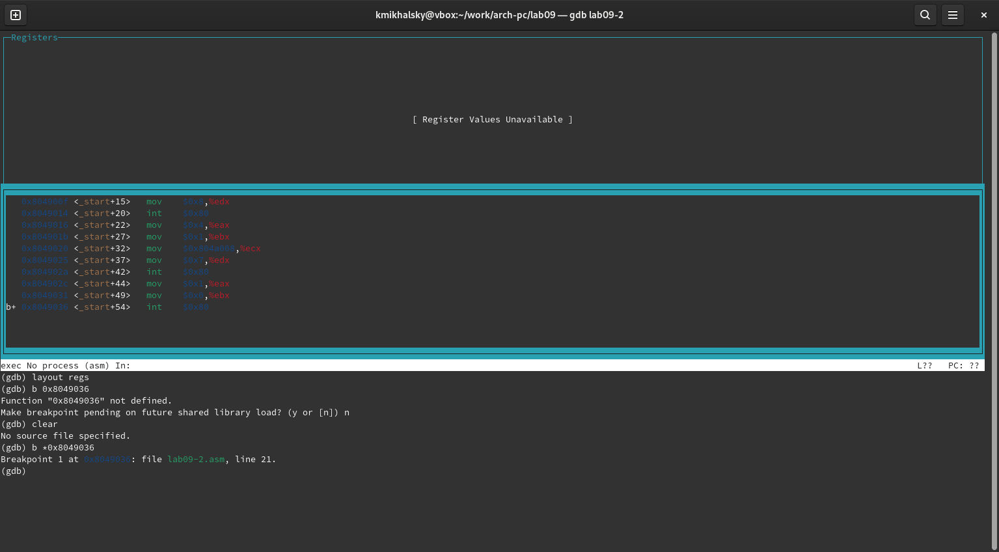

---
## Front matter
title: "Отчет по лабораторной работе №9"
subtitle: "Архитектура компьютера"
author: "Михальский Кирилл Алексеевич"

## Generic otions
lang: ru-RU
toc-title: "Содержание"

## Bibliography
bibliography: bib/cite.bib
csl: pandoc/csl/gost-r-7-0-5-2008-numeric.csl

## Pdf output format
toc: true # Table of contents
toc-depth: 2
lof: true # List of figures
lot: true # List of tables
fontsize: 12pt
linestretch: 1.5
papersize: a4
documentclass: scrreprt
## I18n polyglossia
polyglossia-lang:
  name: russian
  options:
	- spelling=modern
	- babelshorthands=true
polyglossia-otherlangs:
  name: english
## I18n babel
babel-lang: russian
babel-otherlangs: english
## Fonts
mainfont: IBM Plex Serif
romanfont: IBM Plex Serif
sansfont: IBM Plex Sans
monofont: IBM Plex Mono
mathfont: STIX Two Math
mainfontoptions: Ligatures=Common,Ligatures=TeX,Scale=0.94
romanfontoptions: Ligatures=Common,Ligatures=TeX,Scale=0.94
sansfontoptions: Ligatures=Common,Ligatures=TeX,Scale=MatchLowercase,Scale=0.94
monofontoptions: Scale=MatchLowercase,Scale=0.94,FakeStretch=0.9
mathfontoptions:
## Biblatex
biblatex: true
biblio-style: "gost-numeric"
biblatexoptions:
  - parentracker=true
  - backend=biber
  - hyperref=auto
  - language=auto
  - autolang=other*
  - citestyle=gost-numeric
## Pandoc-crossref LaTeX customization
figureTitle: "Рис."
tableTitle: "Таблица"
listingTitle: "Листинг"
lofTitle: "Список иллюстраций"
lotTitle: "Список таблиц"
lolTitle: "Листинги"
## Misc options
indent: true
header-includes:
  - \usepackage{indentfirst}
  - \usepackage{float} # keep figures where there are in the text
  - \floatplacement{figure}{H} # keep figures where there are in the text
---

# Цель работы

Приобритение навыков по работе с подпрограммами и методами отладки GDB.

# Задание

1. Реализация подпрограмм nasm
2. Отладка программ в gdb
3. Выполение заданий для самостоятельной работы

# Теоретическое введение

Подпрограмма - это условная функция, прописанная в программе, которая берет на себя выполнение определнных дейтвий с входными данными и выдачу выходных данных. Подпрограмма используется для сокращения кода и придачи ему понятной структуры.

Отладчик - программа для поиска и исправления ошибок в программе. Отладчик позволяет "разобрать" выполнение программы, проанализировать ее поэтапно.

# Выполнение лабораторной работы

1. Создал необходимые каталоги и файлы.

{#fig:001 width=70%}

2. Скопировал текст из листинга и проверил правильность программы.

{#fig:002 width=70%}

3. Изменил текст программы по условию.

{#fig:003 width=70%}

4. Создал файл, вставил текст из листинга и создал файл для отладки.

{#fig:004 width=70%}

5. Добавил брейкпоинт на метку _start

{#fig:005 width=70%}

6. Перевожу в работу с синтаксисом intel

{#fig:006 width=70%}

7. Включаю режим псевдографики.

{#fig:007 width=70%}

8. Добавляю брейкпоинт

{#fig:008 width=70%}

Проверяю добавление брейкпоинта.

{#fig:009 width=70%}

10. Просматриваю содержимое регистров.

[Отладка](image/Screenshot from 2024-12-07 22-19-19.png){#fig:010 width=70%}

11. Меняю текст переменных.

[Отладка](image/Screenshot from 2024-12-07 22-43-04.png){#fig:011 width=70%}

[Отладка](image/Screenshot from 2024-12-07 22-43-55.png){#fig:012 width=70%}

12. Вывожу в различных форматах значение регистра.

[Отладка](image/Screenshot from 2024-12-07 22-44-36.png){#fig:013 width=70%}

13. Меняю значение регистра коммандой.

[Отладка](image/Screenshot from 2024-12-07 22-46-15.png){#fig:014 width=70%}

14. Создал листинговый файл 

[Отладка](image/Screenshot from 2024-12-15 20-01-59.png){#fig:015 width=70%}

15. Запускаю программу в gdb. Аргумент +24 означает, что аргументы на взод закончились. Шаг равен 4 изза разрядности системы.

[Отладка](image/Screenshot from 2024-12-15 20-09-43.png){#fig:016 width=70%}

# Задания для самостоятельной работы

1. Изменил текст программы по заданию.

[Текст программы](image/Screenshot from 2024-12-15 20-09-43.png){#fig:017 width=70%}

2. Запускаю программу в gdb. Нахожу ошибку.

[Отладка](image/Screenshot from 2024-12-15 20-49-23.png){#fig:018 width=70%}

3. Проверяю правильность исправленной программы.

[Проверка](image/Screenshot from 2024-12-15 20-55-38.png){#fig:019 width=70%}

# Выводы

Приобрел навыки по работе с подпрограммами и отладчиком gdb.

# Список литературы{.unnumbered}

::: {#refs}
:::
