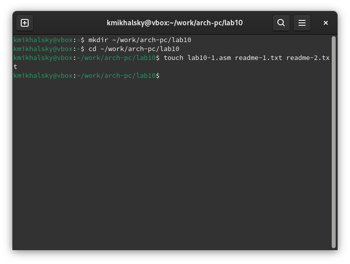
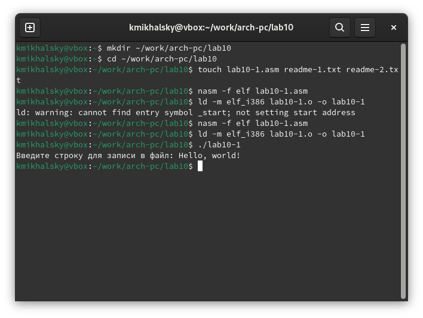
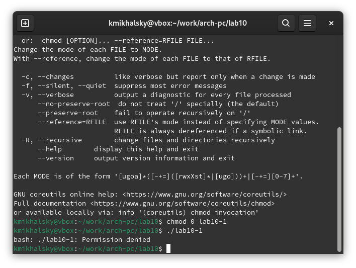
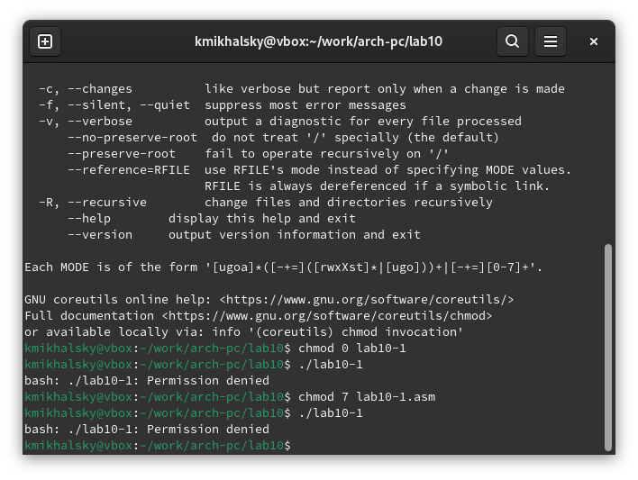
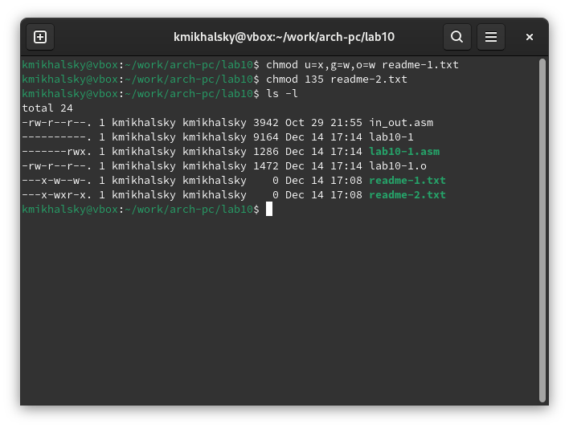
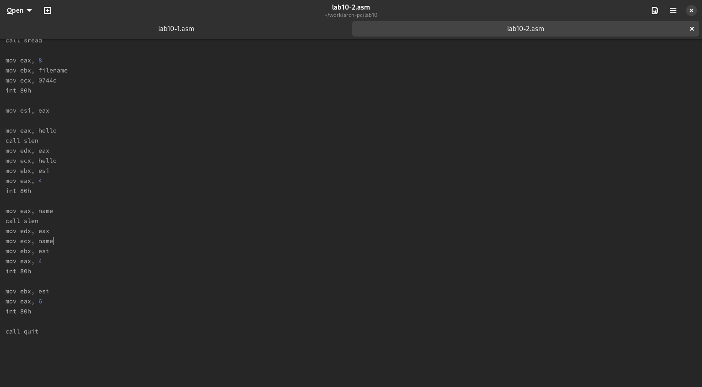
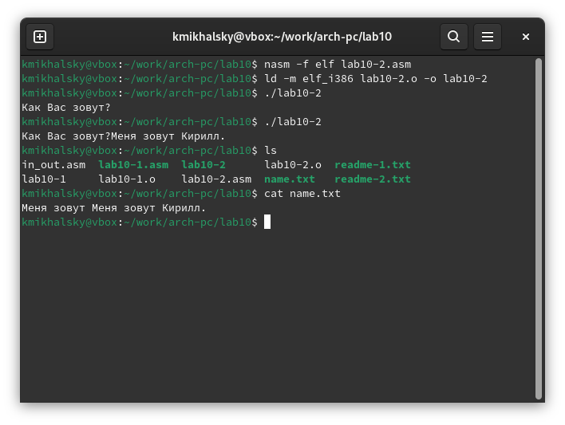

---
## Front matter
title: "Отчет по лабораторной работе №10"
subtitle: "Простейший вариант"
author: "Михальский Кирилл Алексеевич"

## Generic otions
lang: ru-RU
toc-title: "Содержание"

## Bibliography
bibliography: bib/cite.bib
csl: pandoc/csl/gost-r-7-0-5-2008-numeric.csl

## Pdf output format
toc: true # Table of contents
toc-depth: 2
lof: true # List of figures
lot: true # List of tables
fontsize: 12pt
linestretch: 1.5
papersize: a4
documentclass: scrreprt
## I18n polyglossia
polyglossia-lang:
  name: russian
  options:
	- spelling=modern
	- babelshorthands=true
polyglossia-otherlangs:
  name: english
## I18n babel
babel-lang: russian
babel-otherlangs: english
## Fonts
mainfont: IBM Plex Serif
romanfont: IBM Plex Serif
sansfont: IBM Plex Sans
monofont: IBM Plex Mono
mathfont: STIX Two Math
mainfontoptions: Ligatures=Common,Ligatures=TeX,Scale=0.94
romanfontoptions: Ligatures=Common,Ligatures=TeX,Scale=0.94
sansfontoptions: Ligatures=Common,Ligatures=TeX,Scale=MatchLowercase,Scale=0.94
monofontoptions: Scale=MatchLowercase,Scale=0.94,FakeStretch=0.9
mathfontoptions:
## Biblatex
biblatex: true
biblio-style: "gost-numeric"
biblatexoptions:
  - parentracker=true
  - backend=biber
  - hyperref=auto
  - language=auto
  - autolang=other*
  - citestyle=gost-numeric
## Pandoc-crossref LaTeX customization
figureTitle: "Рис."
tableTitle: "Таблица"
listingTitle: "Листинг"
lofTitle: "Список иллюстраций"
lotTitle: "Список таблиц"
lolTitle: "Листинги"
## Misc options
indent: true
header-includes:
  - \usepackage{indentfirst}
  - \usepackage{float} # keep figures where there are in the text
  - \floatplacement{figure}{H} # keep figures where there are in the text
---

# Цель работы

Приобрести навыки по работе с файлами в nasm.

# Задание

1. Создание файлов через программу nasm
2. Изменение прав на просмотр, редактирование и запуск файлов
3. Выполнение самостоятельной работы

# Теоретическое введение

В OC GNU/Linux присутствует защита разных групп пользователей от других пользователей и от больших возможностей самой ОС. Ограничение доступа к разным операциям над файлами помогает сохранять стабильность системы и позволяет нескольким пользователем работать в одной ОС. 

# Выполнение лабораторной работы

1. Создал каталог и файлы.

{#fig:001 width=70%}

2. Ввел текст из листинга 10.1 и проверил работу программы.

{#fig:003 width=70%}

3. Изменил доступ к файлу lab10-1. Из-за того, что доступ к выполнению исполняемого файла отсутствует, система выдает ошибку доступа.

{#fig:004 width=70%}

4. Изменил доступ к файлу с кодом программы я никак не меняю доступ на исполнение исполняемого файла.

{#fig:005 width=70%}

5. Изменил доступ с помощью команды chmod. Проверил правильность выполненных действий.

{#fig:006 width=70%}

# Задания для самостоятельной работы

1. Написал текст программы, запустил и проверил правильность выполненных действий.

{#fig:007 width=70%}

{#fig:008 width=70%}

# Выводы

Приобрел навыки работы с файлами в nasm среде.

# Список литературы{.unnumbered}

::: {#refs}
:::
